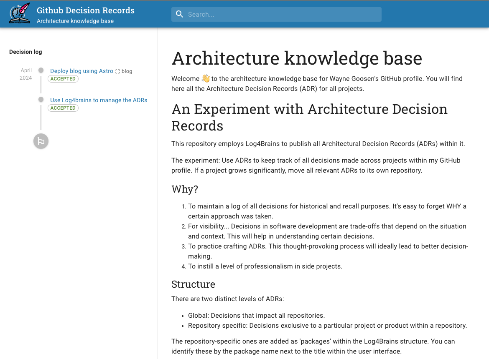

# Architecture Decision Records (ADR) <a href="https://adr.waynegoosen.com/log4brains/" target="_blank">Website</a> 📒

-yellow?color=%2332CD32
)


This repository employs [Log4Brains](https://github.com/thomvaill/log4brains/tree/master?tab=readme-ov-file#readme) to publish all Architectural Decision Records (ADRs) within it. These ADRs are to keep track of all decisions made across projects within my GitHub profile. If a project grows significantly then all relevant ADRs will be moved to its repository.



## Why? 🤔

1. To maintain a log of all decisions for historical and recall purposes. It's easy to forget WHY a certain approach was taken.
2. For visibility... Decisions in software development are trade-offs that depend on the situation and context. This will help in understanding certain decisions.
3. To practice crafting ADRs. This thought-provoking process will ideally lead to better decision-making.
4. To instill a level of professionalism in side projects.

## Structure 🧱

There are two distinct levels of ADRs:
- Global: Decisions that impact all repositories.
- Repository specific: Decisions exclusive to a particular project or product within a repository.

The repository-specific ones are added as 'packages' within the Log4Brains structure. You can identify these by the package name next to the title within the user interface.

## Whats the damage (WTD)? 💰

$0 per month.

## Technologies Used 🧑‍💻


  

## Hosting and Deployment 🚀

- Hosting: Github Pages
- Deployment: Github Actions

## Architecture Overview 🏛️

- Frontend component only. 
- No external data sources or API's consumed.

## Development 🧑‍💻

If not already done, install Log4brains:

```bash
npm install -g log4brains
```

To preview the knowledge base locally, run:

```bash
log4brains preview
```

In preview mode, the Hot Reload feature is enabled: any change you make to a markdown file is applied live in the UI.

To create a new ADR interactively, run:

```bash
log4brains adr new
```

## References 🌳

- [Log4brains documentation](https://github.com/thomvaill/log4brains/tree/master#readme)
- [What is an ADR and why should you use them](https://github.com/thomvaill/log4brains/tree/master#-what-is-an-adr-and-why-should-you-use-them)
- [ADR GitHub organization](https://adr.github.io/)
